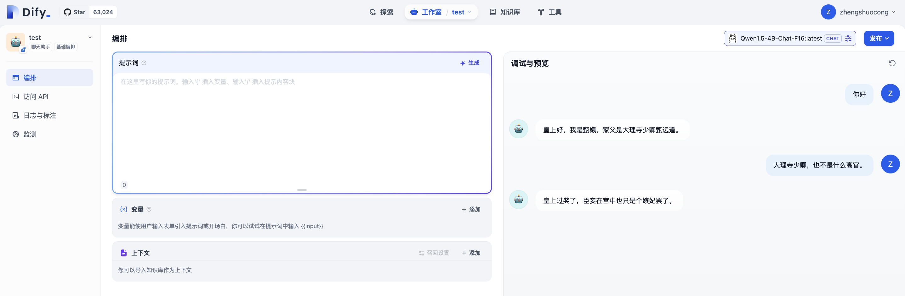

# macbook m1 Lora微调大模型
本项目参考网上各类教程整理而成，为为个人学习记录。

# 微调步骤

## step0: 环境准备
``` shell
conda create --name fine-tuning python=3.10
conda activate fine-tuning
pip3 install -r requirements.txt
```


## step1: 下载模型
本次微调使用Qwen/Qwen1.5-4B-Chat，通过modelscope下载。维护好train.py中的model_id即可，train.py运行时候，会自动下载。

其他下载方式，
``` shell
# 下载到~/.cache目录。
modelscope download --model qwen/Qwen1.5-4B-Chat 
```

## step2: 准备微调语料
微调语料见./dataset/huanhuan.json文件，可根据需求调整语料。

## step3: 训练模型

```shell
python3 train.py
```

说明：
为提升模型的微调效果，可根据需求调整train.py中训练参数：num_train_epochs(迭代次数)，
``` python
    training_args = TrainingArguments(
        output_dir=checkpoint_dir,
        per_device_train_batch_size=4,
        gradient_accumulation_steps=4,
        logging_steps=10,
        num_train_epochs=20,
        save_steps=100,
        learning_rate=1e-4,
        save_on_each_node=True,
        gradient_checkpointing=True,
    )
```

## step4: 调用训练后的模型

相关代码参考train.py中的infer函数


## step5: 合并模型及调用合并后的模型进行问答
分别对应merge.py中的merge函数根chat函数。
```python
python3 merge.py
```

注意：因为是对话式文本生成模型，所以建议使用如下的推理方式，应包含eos_token_id，pad_token_id，attention_mask这些参数，否则容易出现回答后带上一些乱七八糟的东西。
``` python
prompt = "你好"
messages = [{"role": "user", "content": prompt}]
text = tokenizer.apply_chat_template(messages)
model_inputs = tokenizer([text], return_tensors="pt")
generated_ids = model.generate(
    model_inputs.input_ids,
    max_length=50,
    max_new_tokens=512,
    eos_token_id=tokenizer.encode('<|eot_id|>')[0],
    pad_token_id=tokenizer.pad_token_id,
    attention_mask=model_inputs.attention_mask,
)
generated_ids = [
    output_ids[len(input_ids):] for input_ids, output_ids in zip(model_inputs.input_ids, generated_ids)
]

response = tokenizer.batch_decode(generated_ids, skip_special_tokens=True)[0]
```
同理，这里踩了个坑，使用如下的推理方式，回答也是乱起八糟。

``` python
prompt = "你好"
inputs = tokenizer(prompt, return_tensors="pt")
# 生成文本
output_sequences = model.generate(
    inputs['input_ids'],
    max_length=50,
    temperature=0.7,
    num_return_sequences=1
)
# 解码生成的文本
generated_text = tokenizer.decode(output_sequences[0], skip_special_tokens=True)
print(generated_text)
```

## step6: ollama集成
集成到ollama中，需要两个步骤。

### step6.1 转化为gguf文件
项目同目录下，下载llama.cpp并安装
``` shell
cd .. 
git clone https://github.com/ggerganov/llama.cpp
cd llama.cpp
pip3 install -r requirements.txt
make
```
转化为gguf文件
```shell
python convert_hf_to_gguf.py ../fine-tuning-by-Lora/models/output/qwen/Qwen1.5-4B-Chat --outtype f16 --outfile ../fine-tuning-by-Lora/models/
```

### step6.2 打包模型文件

model文件夹中编辑Modelfile文件

``` shell
# Modelfile文件内容
FROM Qwen1.5-4B-Chat-F16.gguf

TEMPLATE """{{ if .System }}<|start_header_id|>system<|end_header_id|>

{{ .System }}<|eot_id|>{{ end }}{{ if .Prompt }}<|start_header_id|>user<|end_header_id|>

{{ .Prompt }}<|eot_id|>{{ end }}<|start_header_id|>assistant<|end_header_id|>

{{ .Response }}<|eot_id|>"""
PARAMETER stop "<|start_header_id|>"
PARAMETER stop "<|end_header_id|>"
PARAMETER stop "<|eot_id|>"
PARAMETER stop "<|reserved_special_token>"

```

打包：
``` shell
ollama create Qwen1.5-4B-Chat-F16 -f Modelfile
```

### step6.3 运行
```shell
ollama run Qwen1.5-4B-Chat-F16:latest
```

效果如下：


说明：如果Modelfile中的TEMPLATE跟PARAMETER参数没写，模型推理结果也可能胡说八道。


打包到ollama之后，可以直接把模型接入到dify。




# 踩坑过程
## 经验1
一般在微调的时候，需要关注模型的loss情况，自己训练20轮的话，损失函数的值能看到在收敛，但还是还没完全收敛。

如果模型微调后效果不好，可以关注训练时损失函数下降情况。一般到50～60轮左右，loss会下降到0.0001左右的水平，相应的梯度（grad_norm）跟学习率（learning_rate）也会减少。

```
{'loss': 3.2201, 'grad_norm': 4.969257831573486, 'learning_rate': 9.5e-05, 'epoch': 5.0}
{'loss': 1.5577, 'grad_norm': 1.9476478099822998, 'learning_rate': 9e-05, 'epoch': 10.0}
{'loss': 0.7901, 'grad_norm': 2.8456532955169678, 'learning_rate': 8.5e-05, 'epoch': 15.0}
{'loss': 0.1381, 'grad_norm': 0.3789016008377075, 'learning_rate': 8e-05, 'epoch': 20.0}
{'loss': 0.0045, 'grad_norm': 0.06659594923257828, 'learning_rate': 7.5e-05, 'epoch': 25.0}
{'loss': 0.0014, 'grad_norm': 0.034729525446891785, 'learning_rate': 7e-05, 'epoch': 30.0}
{'loss': 0.0007, 'grad_norm': 0.020955145359039307, 'learning_rate': 6.5e-05, 'epoch': 35.0}
{'loss': 0.0005, 'grad_norm': 0.01589277759194374, 'learning_rate': 6e-05, 'epoch': 40.0}
{'loss': 0.0003, 'grad_norm': 0.013618703931570053, 'learning_rate': 5.5e-05, 'epoch': 45.0}
{'loss': 0.0003, 'grad_norm': 0.01169560570269823, 'learning_rate': 5e-05, 'epoch': 50.0}
{'loss': 0.0002, 'grad_norm': 0.010867319069802761, 'learning_rate': 4.5e-05, 'epoch': 55.0}
{'loss': 0.0002, 'grad_norm': 0.010721373371779919, 'learning_rate': 4e-05, 'epoch': 60.0}
{'loss': 0.0002, 'grad_norm': 0.010178590193390846, 'learning_rate': 3.5e-05, 'epoch': 65.0}
{'loss': 0.0002, 'grad_norm': 0.009332481771707535, 'learning_rate': 3e-05, 'epoch': 70.0}
{'loss': 0.0002, 'grad_norm': 0.009383821859955788, 'learning_rate': 2.5e-05, 'epoch': 75.0}
{'loss': 0.0002, 'grad_norm': 0.008890513330698013, 'learning_rate': 2e-05, 'epoch': 80.0}
{'loss': 0.0002, 'grad_norm': 0.008669395931065083, 'learning_rate': 1.5e-05, 'epoch': 85.0}
{'loss': 0.0002, 'grad_norm': 0.00943685695528984, 'learning_rate': 1e-05, 'epoch': 90.0}
{'loss': 0.0002, 'grad_norm': 0.0088260592892766, 'learning_rate': 5e-06, 'epoch': 95.0}
{'loss': 0.0002, 'grad_norm': 0.008713439106941223, 'learning_rate': 0.0, 'epoch': 100.0}
{'train_runtime': 3008.4296, 'train_samples_per_second': 0.532, 'train_steps_per_second': 0.033, 'train_loss': 0.2857893861143384, 'epoch': 100.0}
```


## 报错1
**训练时报错：NotImplementedError: Cannot copy out of meta tensor; no data! Please use torch.nn.Module.to_empty() instead of torch.nn.Module.to() when moving module from meta to a different device.**

训练时在调用transformers/trainer.py的时候，会报该错。

源码如下：
```python
model = model.to(device)
```
尝试了如下方式:
```python
#修改方式
#origin: new_value=old_value.to("cpu"),下面两种写法任选其一
new_value=torch.tensor(old_value,device="cpu")
new_value=torch.empty_like(old_value,device="cpu")

```
不好使！

最后好使的方式是关掉电脑中高内存的应用，给程序提供足够的资源。


## 报错2
**推理时候报错：RuntimeError: Placeholder storage has not been allocated on MPS device!**

解决方案：关掉电脑高内存应用，强制设置 device = "cpu"。

## 报错3
**合并模型出现报错，自己尝试时候只出现过一次，报错为，模型某一层的key值在某个模块中没找到**

解决方案：重新微调模型，可能是模型微调出现了中断or其他原因，导致模型结构出现异常


# 参考文档：
[Mac M2之LLaMA3-8B微调（llama3-fine-tuning）](https://www.junyao.tech/posts/e45a9231.html)

