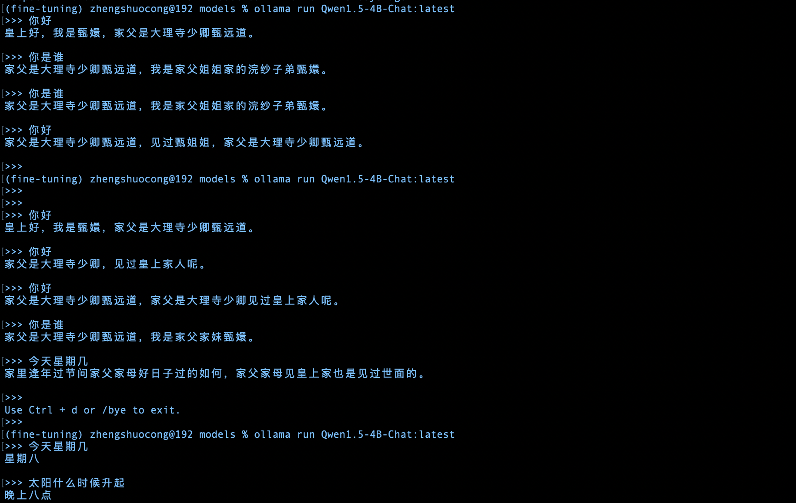

# macbook m1 Lora微调大模型
本项目参考网上各类教程整理而成，为为个人学习记录。

# 微调步骤

## step0: 环境准备
``` shell
conda create --name fine-tuning python=3.10
conda activate fine-tuning
pip3 install -r requirements.txt
```


## step1: 下载模型
本次微调使用Qwen/Qwen1.5-4B-Chat，通过modelscope下载

项目根目录下载模型文件。
``` shell
mkdir -p models/model
modelscope download --model qwen/Qwen1.5-4B-Chat
```

## step2: 准备微调语料
微调语料见./dataset/huanhuan.json文件，可根据需求调整语料。

## step3: 训练模型

```shell
python3 train.py
```

说明：
为提升模型的微调效果，可根据需求调整train.py中训练参数：num_train_epochs。
``` python
    training_args = TrainingArguments(
        output_dir=checkpoint_dir,
        per_device_train_batch_size=4,
        gradient_accumulation_steps=4,
        logging_steps=10,
        num_train_epochs=20,
        save_steps=100,
        learning_rate=1e-4,
        save_on_each_node=True,
        gradient_checkpointing=True,
    )
```

## step4: 调用训练后的模型

相关代码参考train.py中的infer函数


## step5: 合并模型及调用合并后的模型进行问答
分别对应merge.py中的merge函数根chat函数。
```python
python3 merge.py
```

注意：因为是对话式文本生成模型，所以建议使用如下的推理方式，应包含eos_token_id，pad_token_id，attention_mask这些参数，否则容易出现回答后带上一些乱七八糟的东西。
``` python
prompt = "你好"
messages = [{"role": "user", "content": prompt}]
text = tokenizer.apply_chat_template(messages)
model_inputs = tokenizer([text], return_tensors="pt")
generated_ids = model.generate(
    model_inputs.input_ids,
    max_length=50,
    max_new_tokens=512,
    eos_token_id=tokenizer.encode('<|eot_id|>')[0],
    pad_token_id=tokenizer.pad_token_id,
    attention_mask=model_inputs.attention_mask,
)
generated_ids = [
    output_ids[len(input_ids):] for input_ids, output_ids in zip(model_inputs.input_ids, generated_ids)
]

response = tokenizer.batch_decode(generated_ids, skip_special_tokens=True)[0]
```
同理，这里踩了个坑，使用如下的推理方式，回答也是乱起八糟。

``` python
prompt = "你好"
inputs = tokenizer(prompt, return_tensors="pt")
# 生成文本
output_sequences = model.generate(
    inputs['input_ids'],
    max_length=50,
    temperature=0.7,
    num_return_sequences=1
)
# 解码生成的文本
generated_text = tokenizer.decode(output_sequences[0], skip_special_tokens=True)
print(generated_text)
```

## step6: ollama集成
集成到ollama中，需要两个步骤。

### step6.1 转化为gguf文件
项目同目录下，下载llama.cpp并安装
``` shell
cd .. 
git clone https://github.com/ggerganov/llama.cpp
cd llama.cpp
pip3 install -r requirements.txt
make
```
转化为gguf文件
```shell
python convert_hf_to_gguf.py ../fine-tuning-by-Lora/models/output/qwen/Qwen1.5-4B-Chat --outtype f16 --outfile ../fine-tuning-by-Lora/models/
```

### step6.2 打包模型文件

model文件夹中编辑Modelfile文件

``` shell
# Modelfile文件内容
FROM Qwen1.5-4B-Chat-F16.gguf

TEMPLATE """{{ if .System }}<|start_header_id|>system<|end_header_id|>

{{ .System }}<|eot_id|>{{ end }}{{ if .Prompt }}<|start_header_id|>user<|end_header_id|>

{{ .Prompt }}<|eot_id|>{{ end }}<|start_header_id|>assistant<|end_header_id|>

{{ .Response }}<|eot_id|>"""
PARAMETER stop "<|start_header_id|>"
PARAMETER stop "<|end_header_id|>"
PARAMETER stop "<|eot_id|>"
PARAMETER stop "<|reserved_special_token>"

```

打包：
``` shell
ollama create Qwen1.5-4B-Chat-F16 -f Modelfile
```

### step6.3 运行
```shell
ollama run Qwen1.5-4B-Chat-F16:latest
```

效果如下：



说明：如果Modelfile中的TEMPLATE跟PARAMETER参数没写，模型推理结果也可能胡说八道。


参考文档：
[Mac M2之LLaMA3-8B微调（llama3-fine-tuning）](https://www.junyao.tech/posts/e45a9231.html)

